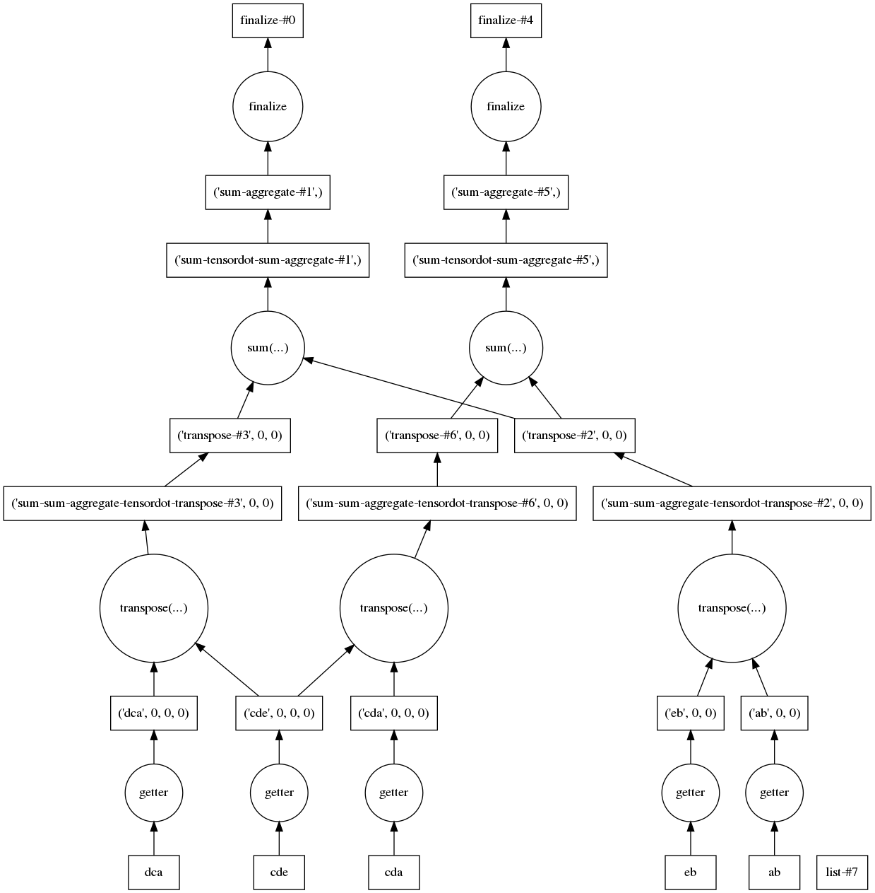

# Reusing Intermediaries with Dask

[Dask](https://dask.pydata.org/) provides a computational framework where arrays and the computations on them are built up into a 'task graph' before computation.
Since :mod:`opt_einsum` is compatible with `dask` arrays this means that multiple contractions can be built into the same task graph, which then automatically reuses any shared arrays and contractions.

For example, imagine the two expressions:

```python
contraction1 = 'ab,dca,eb,cde'
contraction2 = 'ab,cda,eb,cde'
sizes = {l: 10 for l in 'abcde'}
```

The contraction `'ab,eb'` is shared between them and could only be done once.
First, let's set up some `numpy` arrays:

```python
terms1, terms2 = contraction1.split(','), contraction2.split(',')
terms = set((*terms1, *terms2))
terms
#> {'ab', 'cda', 'cde', 'dca', 'eb'}

import numpy as np
np_arrays = {s: np.random.randn(*(sizes[c] for c in s)) for s in terms}
# filter the arrays needed for each expression
np_ops1 = [np_arrays[s] for s in terms1]
np_ops2 = [np_arrays[s] for s in terms2]
```

Typically we would compute these expressions separately:

```python
oe.contract(contraction1, *np_ops1)
#> array(114.78314052)

oe.contract(contraction2, *np_ops2)
#> array(-75.55902751)
```


However, if we use dask arrays we can combine the two operations, so let's set those up:

```python
import dask.array as da
da_arrays = {s: da.from_array(np_arrays[s], chunks=1000, name=s) for s in inputs}
da_arrays
#> {'ab': dask.array<ab, shape=(10, 10), dtype=float64, chunksize=(10, 10)>,
#>  'cda': dask.array<cda, shape=(10, 10, 10), dtype=float64, chunksize=(10, 10, 10)>,
#>  'cde': dask.array<cde, shape=(10, 10, 10), dtype=float64, chunksize=(10, 10, 10)>,
#>  'dca': dask.array<dca, shape=(10, 10, 10), dtype=float64, chunksize=(10, 10, 10)>,
#>  'eb': dask.array<eb, shape=(10, 10), dtype=float64, chunksize=(10, 10)>}

da_ops1 = [da_arrays[s] for s in terms1]
da_ops2 = [da_arrays[s] for s in terms2]
```

Note `chunks` is a required argument relating to how the arrays are stored (see [array-creation](http://dask.pydata.org/en/latest/array-creation.html)).
Now we can perform the contraction:

```python
# these won't be immediately evaluated
dy1 = oe.contract(contraction1, *da_ops1, backend='dask')
dy2 = oe.contract(contraction2, *da_ops2, backend='dask')

# wrap them in delayed to combine them into the same computation
from dask import delayed
dy = delayed([dy1, dy2])
dy
#> Delayed('list-3af82335-b75e-47d6-b800-68490fc865fd')
```

As suggested by the name `Delayed`, we have a placeholder for the result
so far. When we want to *perform* the computation we can call:

```python
dy.compute()
#> [114.78314052155015, -75.55902750513113]
```

The above matches the canonical numpy result. The computation can even be handled by various
schedulers - see [scheduling](http://dask.pydata.org/en/latest/scheduling.html).
Finally, to check we are reusing intermediaries, we can view the task graph generated for the computation:

```python
dy.visualize(optimize_graph=True)
```



!!! note
    For sharing intermediates with other backends see [Sharing Intermediates](../getting_started/sharing_intermediates.md). Dask graphs are particularly useful for reusing intermediates beyond just contractions and can allow additional parallelization.
