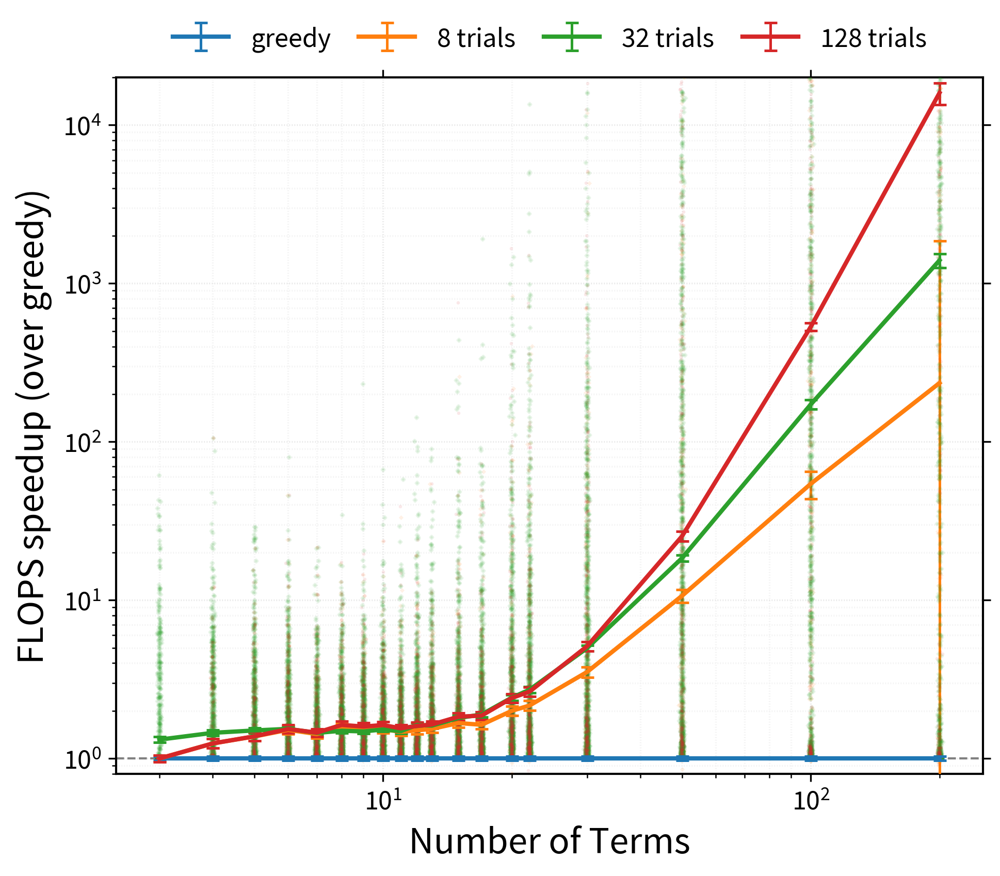

# The Random-Greedy Path

For large *and* complex contractions the exhaustive approaches will be too slow
while the greedy path might be very far from optimal. In this case you might
want to consider the `'random-greedy'` path optimizer. This samples many
greedy paths and selects the best one found, which can often be exponentially
better than the average.

```python
import opt_einsum as oe
import numpy as np
import math

eq, shapes = oe.helpers.rand_equation(40, 5, seed=1, d_max=2)
arrays = list(map(np.ones, shapes))

path_greedy = oe.contract_path(eq, *arrays, optimize='greedy')[1]
print(math.log2(path_greedy.opt_cost))
#> 36.04683022558587

path_rand_greedy = oe.contract_path(eq, *arrays, optimize='random-greedy')[1]
print(math.log2(path_rand_greedy.opt_cost))
#> 32.203616699170865
```

So here the random-greedy approach has found a path about
16 times quicker (`= 2^(36 - 32)`).

This approach works by randomly choosing from the best `n` contractions at
each step, weighted by a
[Boltzmann factor](https://en.wikipedia.org/wiki/Boltzmann_distribution) with
respect to the contraction with the 'best' cost. As such, contractions with
very similar costs will be explored with equal probability, whereas those with
higher costs will be less likely, but still possible. In this way, the
optimizer can randomly explore the huge space of possible paths, but in a
guided manner.

The following graph roughly demonstrates the potential benefits of the
`'random-greedy'` algorithm, here for large randomly generated contractions,
with either 8, 32 (the default), or 128 repeats:



!!! note
    Bear in mind that such speed-ups are not guaranteed - it very much depends
    on how structured or complex your contractions are.


## Customizing the Random-Greedy Path

The random-greedy optimizer can be customized by instantiating your own
[`opt_einsum.paths.RandomGreedy`](../api_reference.md#opt_einsumpath_randomrandomgreedy)
object. Here you can control:

- `temperature` - how far to stray from the locally 'best' contractions
- `rel_temperature` - whether to normalize the temperature
- `nbranch` - how many contractions (branches) to consider at each step
- `cost_fn` - how to cost potential contractions

There are also the main
[`opt_einsum.paths.RandomOptimizer`](../api_reference.md#opt_einsumpath_randomrandomoptimizer)
options:

- `max_repeats` - the maximum number of repeats
- `max_time` - the maximum amount of time to run for (in seconds)
- `minimize` - whether to minimize for total `'flops'` or `'size'` of the
  largest intermediate

For example, here we'll create an optimizer, then change its temperature
whilst reusing it. We'll also set a high `max_repeats` and instead use a
maximum time to terminate the search:

```python
optimizer = oe.RandomGreedy(max_time=2, max_repeats=1_000_000)

for T in [1000, 100, 10, 1, 0.1]:
    optimizer.temperature = T
    path_rand_greedy = oe.contract_path(eq, *arrays, optimize=optimizer)[1]
    print(math.log2(optimizer.best['flops']))

#> 32.81709395639357
#> 32.67625007170783
#> 31.719756871539033
#> 31.62043317835677
#> 31.253305891247

# the total number of trials so far
print(len(optimizer.costs))
#> 2555
```

So we have improved a bit on the standard `'random-greedy'` (which performs 32 repeats by default).
The `optimizer` object now stores both the best path
found so far - `optimizer.path` - as well as the list of flop-costs and
maximum sizes found for each trial - `optimizer.costs` and
`optimizer.sizes` respectively.


## Parallelizing the Random-Greedy Search

Since each greedy attempt is independent, the random-greedy approach is
naturally suited to parallelization. This can be automatically handled by
specifying the `parallel` keyword like so:

```python
# use same number of processes as cores
optimizer = oe.RandomGreedy(parallel=True)

# or use specific number of processes
optimizer = oe.RandomGreedy(parallel=4)
```

!!! warning

    The pool-executor used to perform this parallelization is the
    `ProcessPoolExecutor` from the [`concurrent.futures`
    ](https://docs.python.org/3/library/concurrent.futures.html) module.

For full control over the parallelization you can supply any
pool-executor like object, which should have an API matching the Python 3
[concurrent.futures](https://docs.python.org/3/library/concurrent.futures.html>)
module:

```python
from concurrent.futures import ProcessPoolExecutor

pool = ProcessPoolExecutor()
optimizer = oe.RandomGreedy(parallel=pool, max_repeats=128)
path_rand_greedy = oe.contract_path(eq, *arrays, optimize=optimizer)[1]

print(math.log2(optimizer.best['flops']))
#> 31.64992600300931
```

Other examples of such pools include:

- [loky](https://loky.readthedocs.io/en/latest/)
- [dask.distributed](http://distributed.dask.org/en/latest/)
- [mpi4py](https://mpi4py.readthedocs.io/en/latest/)
