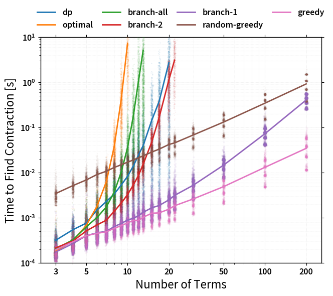
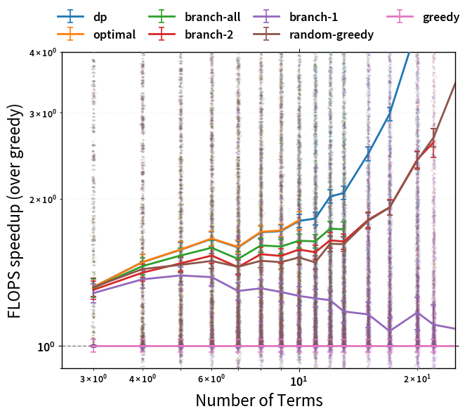

============
Introduction
============

Performing an optimized tensor contraction to speed up ``einsum`` involves two
key stages:

  1. Finding a pairwise contraction order, or **'path'**.
  2. Performing the sequence of contractions given this path.

The better the quality of path found in the first step, the quicker the actual
contraction in the second step can be -- often dramatically. However, finding
the *optimal* path is an NP-hard problem that can quickly become intractable,
meaning that a  balance must be struck between the time spent finding a path,
and its quality. :mod:`opt_einsum` handles this by using several path finding
algorithms, which can be manually specified using the ``optimize`` keyword.
These are:

  * The ``'optimal'`` strategy - an exhaustive search of all possible paths
  * The ``'dynamic-programming'`` strategy - a near-optimal search based off dynamic-programming
  * The ``'branch'`` strategy - a more restricted search of many likely paths
  * The ``'greedy'`` strategy - finds a path one step at a time using a cost
    heuristic

By default (``optimize='auto'``), :func:`~opt_einsum.contract` will select the
best of these it can while aiming to keep path finding times below around 1ms.
An analysis of each of these approaches' performance can be found at the bottom
of this page.

For large and complex contractions, there is the ``'random-greedy'`` approach,
which samples many (by default 32) greedy paths and can be customized to
explicitly spend a maximum amount of time searching. Another preset,
``'random-greedy-128'``, uses 128 paths for a more exhaustive search.
See :ref:`RandomGreedyPathPage` page for more details on configuring these.

Finally, there is the ``'auto-hq'`` preset which targets a much larger search
time (~1sec) in return for finding very high quality paths, dispatching to the
``'optimal'``, ``'dynamic-programming'`` and then ``'random-greedy-128'`` paths
depending on contraction size.

If you want to find the path separately to performing the
contraction, or just inspect information about the path found, you can use the
function :func:`~opt_einsum.contract_path`.

Examining the Path
~~~~~~~~~~~~~~~~~~

As an example, consider the following expression found in a perturbation theory (one of ~5,000 such expressions):

.. code:: python

    'bdik,acaj,ikab,ajac,ikbd'

At first, it would appear that this scales like N^7 as there are 7 unique indices; however, we can define a intermediate to reduce this scaling.

.. code:: python

    a = 'bdik,ikab,ikbd' (N^5 scaling)

    result = 'acaj,ajac,a' (N^4 scaling)

This is a single possible path to the final answer (and notably, not the most optimal) out of many possible paths. Now, let opt_einsum compute the optimal path:

.. code:: python

    import opt_einsum as oe

    # Take a complex string
    einsum_string = 'bdik,acaj,ikab,ajac,ikbd->'

    # Build random views to represent this contraction
    unique_inds = set(einsum_string) - {',', '-', '>'}
    index_size = [10, 17, 9, 10, 13, 16, 15, 14, 12]
    sizes_dict = dict(zip(unique_inds, index_size))
    views = oe.helpers.build_views(einsum_string, sizes_dict)

    path, path_info = oe.contract_path(einsum_string, *views)

    >>> print(path)
    [(0, 4), (1, 3), (0, 1), (0, 1)]

    >>> print(path_info)
      Complete contraction:  bdik,acaj,ikab,ajac,ikbd->
             Naive scaling:  7
         Optimized scaling:  4
          Naive FLOP count:  2.387e+8
      Optimized FLOP count:  8.068e+4
       Theoretical speedup:  2958.354
      Largest intermediate:  1.530e+3 elements
    --------------------------------------------------------------------------------
    scaling        BLAS                current                             remaining
    --------------------------------------------------------------------------------
       4              0         ikbd,bdik->ikb                  acaj,ikab,ajac,ikb->
       4    GEMV/EINSUM            ikb,ikab->a                         acaj,ajac,a->
       3              0           ajac,acaj->a                                 a,a->
       1            DOT                  a,a->                                    ->

We can then check that actually performing the contraction produces the expected result:

.. code:: python

    import numpy as np

    einsum_result = np.einsum("bdik,acaj,ikab,ajac,ikbd->", *views)
    contract_result = oe.contract("bdik,acaj,ikab,ajac,ikbd->", *views)

    >>> np.allclose(einsum_result, contract_result)
    True

By contracting terms in the correct order we can see that this expression can be computed with N^4 scaling. Even with the overhead of finding the best order or 'path' and small dimensions,
``opt_einsum`` is roughly 3000 times faster than pure einsum for this expression.

Format of the Path
~~~~~~~~~~~~~~~~~~

Let us look at the structure of a canonical ``einsum`` path found in NumPy and its optimized variant:

.. code:: python

    einsum_path = [(0, 1, 2, 3, 4)]
    opt_path = [(1, 3), (0, 2), (0, 2), (0, 1)]

In opt_einsum each element of the list represents a single contraction.
In the above example the einsum_path would effectively compute the result as a single contraction identical to that of ``einsum``, while the
opt_path would perform four contractions in order to reduce the overall scaling.
The first tuple in the opt_path, ``(1,3)``, pops the second and fourth terms, then contracts them together to produce a new term which is then appended to the list of terms, this is continued until all terms are contracted.
An example should illuminate this:

.. code:: python

    ---------------------------------------------------------------------------------
    scaling   GEMM                   current                                remaining
    ---------------------------------------------------------------------------------
    terms = ['bdik', 'acaj', 'ikab', 'ajac', 'ikbd'] contraction = (1, 3)
      3     False              ajac,acaj->a                       bdik,ikab,ikbd,a->
    terms = ['bdik', 'ikab', 'ikbd', 'a'] contraction = (0, 2)
      4     False            ikbd,bdik->bik                             ikab,a,bik->
    terms = ['ikab', 'a', 'bik'] contraction = (0, 2)
      4     False              bik,ikab->a                                    a,a->
    terms = ['a', 'a'] contraction = (0, 1)
      1       DOT                    a,a->                                       ->

A path specified in this format can explicitly be supplied directly to
:func:`~opt_einsum.contract` using the ``optimize`` keyword:

.. code:: python

    contract_result = oe.contract("bdik,acaj,ikab,ajac,ikbd->", *views, optimize=opt_path)

    >>> np.allclose(einsum_result, contract_result)
    True

Performance Comparison
~~~~~~~~~~~~~~~~~~~~~~

The following graphs should give some indication of the tradeoffs between path
finding time and path quality. They are generated by finding paths with each
possible algorithm for many randomly generated networks of ``n`` tensors with
varying connectivity.

First we have the time to find each path as a function of the number of terms
in the expression:

Clearly the exhaustive (``'optimal'``, ``'branch-all'``) and exponential
(``'branch-2'``) searches eventually scale badly, but for modest amounts of
terms they incur only a small overhead. The ``'random-greedy'`` approach is not
shown here as it is simply ``max_repeats`` times slower than the ``'greedy'``
approach - at least if not parallelized.

Next we can look at the average FLOP speedup (as compared to the easiest path
to find, ``'greedy'``):

One can see that the heirarchy of path qualities is:

1. ``'optimal'`` (used by auto for ``n <= 4``)
2. ``'branch-all'`` (used by auto for ``n <= 6``)
3. ``'branch-2'`` (used by auto for ``n <= 8``)
4. ``'branch-1'`` (used by auto for ``n <= 14``)
5. ``'greedy'`` (used by auto for anything larger)

.. note::

    The performance of the ``'random=greedy'`` approach (which is never used
    automatically) can be found separately in :ref:`RandomGreedyPathPage` section.

There are a few important caveats to note with this graph. Firstly, the
benefits of more advanced path finding are very dependent on the complexity of
the expression. For 'simple' contractions, all the different approaches will
*mostly* find the same path (as here). However, for 'tricky' contractions, there
will be certain cases where the more advanced algorithms will find much better
paths. As such, while this graph gives a good idea of the *relative* performance
of each algorithm, the 'average speedup' is not a perfect indicator since
worst-case performance might be more critical.

Note that the speedups for any of the methods as compared to a standard
``einsum`` or a naively chosen path (such as ``path=[(0, 1), (0, 1), ...]``)
are all exponentially large and not shown.
